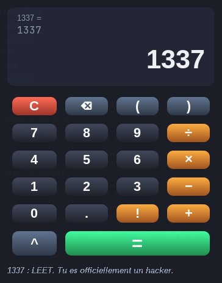
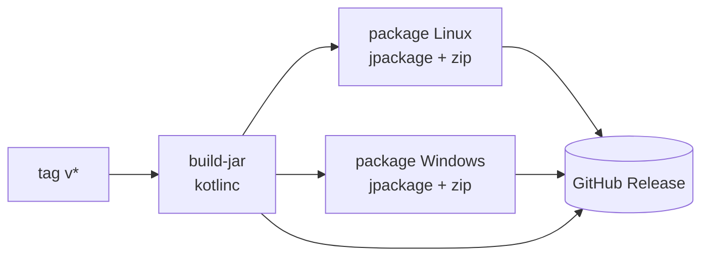

# CalculatriceForFun

> *"Calculatrice 3000 TURBO — approuvée par 9 mathématiciens sur 10. Le 10e n'a pas survécu à une division par zéro."*

Une calculatrice **sérieusement construite** avec un habillage **délibérément délirant**. Sous le capot : un vrai parseur d'expressions avec précédences, parenthèses et gardrails. À l'écran : des explosions de particules, une fenêtre qui tremble, des confettis, et un humour dont elle n'est pas peu fière.



*(Oui, elle célèbre 1337. Et 42. Et aussi 80085, mais on n'en parle pas.)*

---

## Le sérieux sous le capot

Ne vous fiez pas aux confettis, le moteur est du costaud :

| Fonction | Détail |
|---|---|
| Précédences correctes | `2+3×4 = 14`, pas 20. Les maths, c'est non négociable. |
| Parenthèses | Imbriquées à volonté (jusqu'à 10 niveaux — on n'écrit pas une thèse). |
| Puissance `^` | Associative à droite : `2^3^2 = 512`. |
| Factorielle `!` | Entiers de 0 à 170. Au-delà, la calculatrice surchauffe et refuse. |
| Modulo `%` | Parce que parfois on veut juste le reste des choses. |
| Aperçu live | Le résultat se calcule pendant que vous tapez. Elle anticipe, comme une voyante. |
| Multiplication implicite | `3(4)` devient `3×(4)` tout seul. Elle sait ce que vous vouliez dire. |

## Les gardrails

Elle ne crashe jamais, elle se moque de vous à la place :

- Division par zéro → *"Tu viens de casser l'univers."*
- `0^0` → *"Le débat continue, la calculatrice refuse."*
- `171!` → *"La calculatrice surchauffe, elle refuse !"*
- Overflow → jamais d'`Infinity` affiché, toujours un message digne
- `0.1 + 0.2` → affiche `0.3` (formatage à 12 chiffres significatifs)
- Doubles points, parenthèses orphelines, expressions tronquées à 80 caractères → tout est contrôlé

## Le fun par-dessus

- **Explosion de particules** à chaque clic, peu importe le bouton
- **Secousse de fenêtre** à chaque résultat, *grosse* secousse en cas d'erreur
- **Confettis** sur les résultats légendaires : `42`, `69`, `1337`, `80085`, `666`, et tout ce qui dépasse 9000
- **Commentaires moqueurs** contextuels : zéro, nombres négatifs, résultats astronomiques...
- **Titre de la fenêtre** qui change toutes les 5 secondes
- **Bips** quand vous faites une bêtise

## Clavier

Tout est jouable au clavier : chiffres, `+ - * / ( ) . ! ^ %`, `Entrée` pour `=`, `Retour` pour effacer un caractère, `Échap` pour tout effacer. La souris est optionnelle, comme les maths en soirée.

## Lancer l'engin

**Option 1 — IntelliJ IDEA** (le plus simple)

Ouvrez le projet, ouvrez `src/Main.kt`, flèche verte. C'est tout. Aucune dépendance externe : Kotlin + Swing pur.

**Option 2 — Un jar**

```bash
java -jar CalculatriceFun.jar   # Java 17 requis
```

**Option 3 — Exécutable natif** (aucun Java requis)

Prenez le zip de votre OS dans les [Releases](https://github.com/Loocist23/CalculatriceForFun/releases) :

- Linux : dézippez, lancez `CalculatriceFun/bin/CalculatriceFun`
- Windows : dézippez, lancez `CalculatriceFun\CalculatriceFun.exe`

## CI et Releases

À chaque tag `v*`, GitHub Actions construit tout et publie une Release :



macOS n'y est pas — il faisait chier. *(Pour le réactiver : ajouter `macos-latest` dans la matrice du job `package` dans `.github/workflows/release.yml`.)*

## Structure du projet

```
src/
├── Main.kt               le bouton rouge (enfin, vert)
├── CalculatorEngine.kt   le cerveau : parseur récursif + gardrails
├── FunnyCalculator.kt    l'interface, les animations, la saisie
├── ParticleField.kt      le système de particules (glass pane, 60 FPS)
└── Quips.kt              toutes les blagues, au même endroit
```

> *"Tu peux me remercier en math spé." — la calculatrice, après un calcul*
